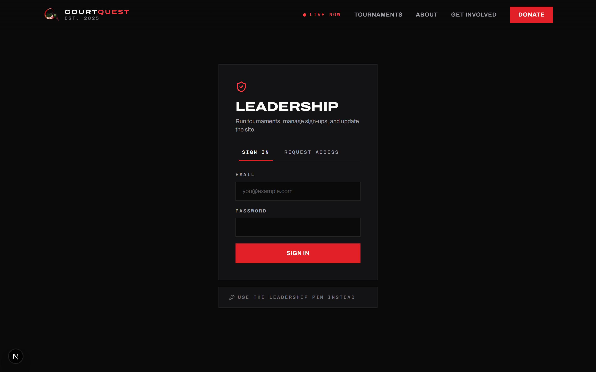
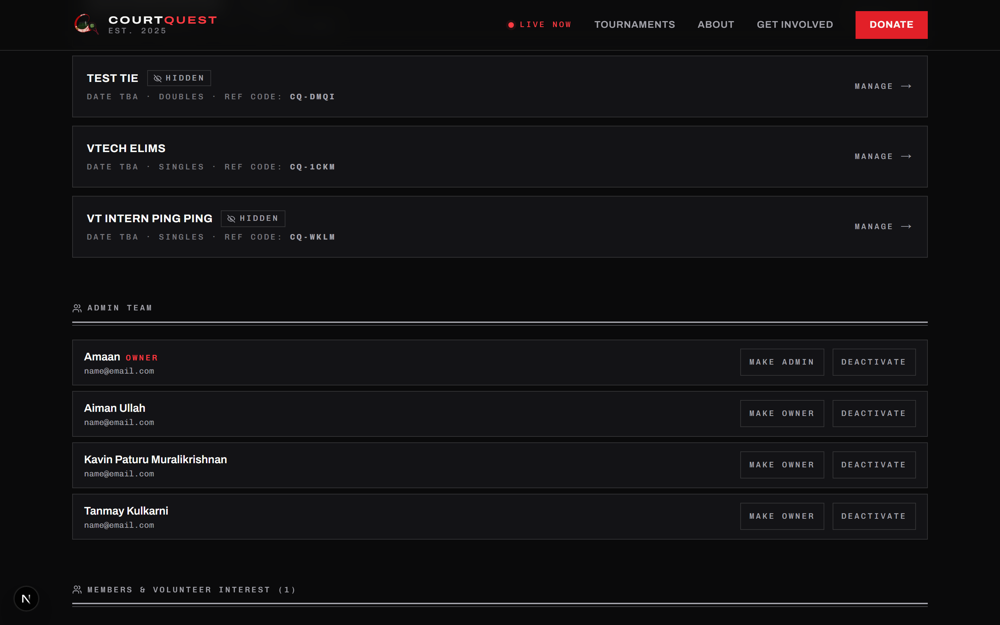
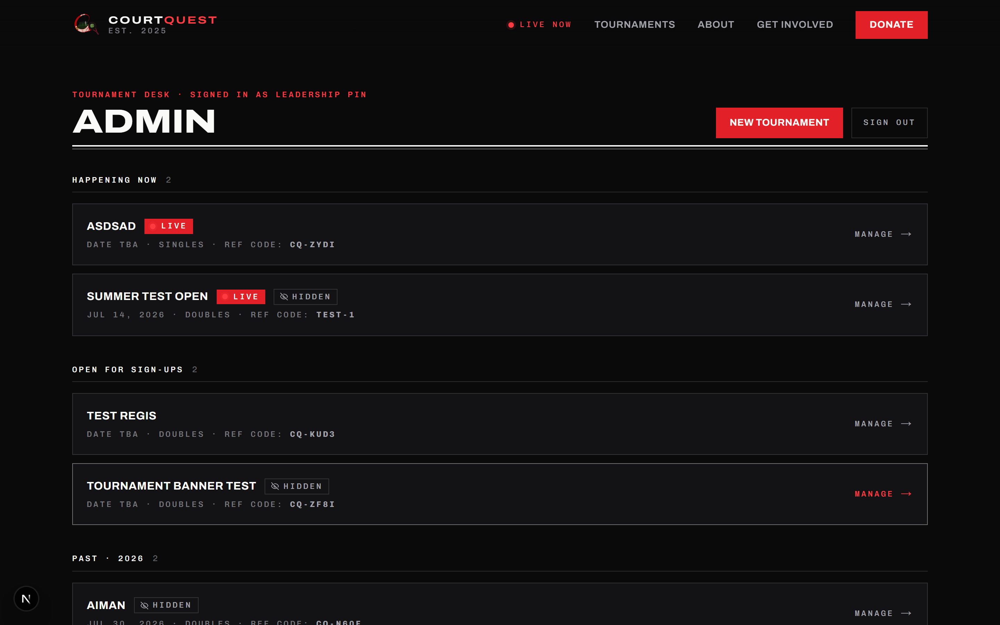
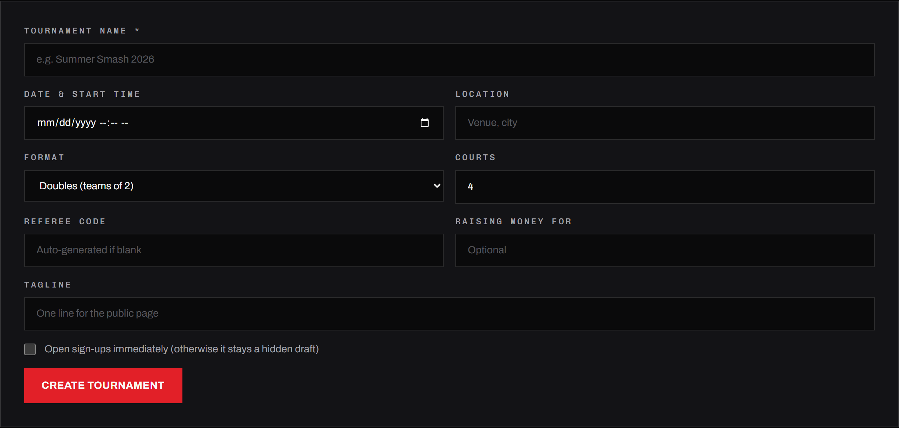
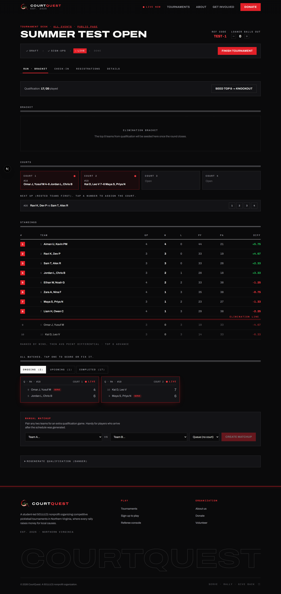
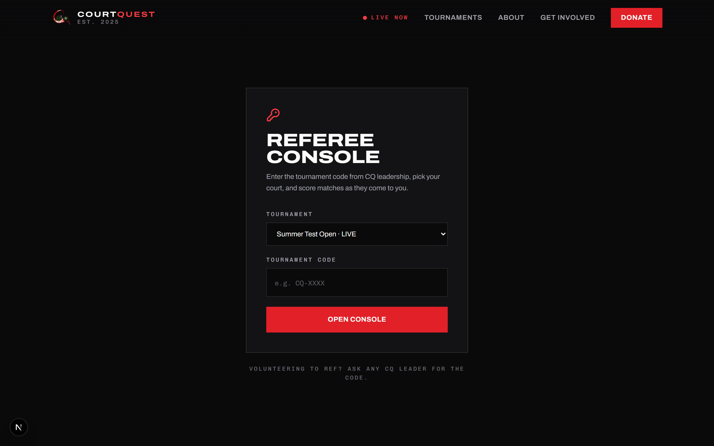

# CourtQuest Admin & Tournament Guide

This guide is for teammates testing or running CourtQuest. It covers getting an
admin account, the admin desk, and running a tournament from check-in to champion.


- Live site: https://courtquest.vercel.app
- Back to the [project README](../README.md)

## Contents

- [A safe place to test](#a-safe-place-to-test)
- [Getting an admin account](#getting-an-admin-account)
- [Approving people (owners only)](#approving-people-owners-only)
- [The admin home page](#the-admin-home-page)
- [Creating a tournament](#creating-a-tournament)
- [Running a tournament](#running-a-tournament)
- [Refereeing](#refereeing)
- [What the public sees](#what-the-public-sees)
- [A full test run](#a-full-test-run)

## A safe place to test

There's a hidden demo tournament called `summer-test-open` with sample teams and a
bracket already in it. It doesn't show up on the public tournaments list, but you
can open it directly to see what a running event looks like:

- Public view: https://courtquest.vercel.app/tournaments/summer-test-open

When you're testing, make your own tournaments and give them obvious names like
"TEST - ignore" so nobody mistakes them for a real event. Everything you create
lives in the same database, so don't run tests during an actual tournament.

## Getting an admin account

Admin lives at `/admin` (there's also a small key icon in the site footer). There
are two ways in.



### Request your own login (what most people should do)

1. Go to https://courtquest.vercel.app/admin
2. Click the **Request access** tab.
3. Enter your name, email, and a password (at least 8 characters).
4. Submit. Your account now exists but is switched off until an owner approves it.
5. Ask an owner to approve you (see below). Once they do, sign in on the same page.

### The leadership PIN (shared fallback)

On the sign-in card there's a "Use the leadership PIN instead" link. The PIN gets
you in as an owner without a personal account. It's handy for a quick check, but a
real account is better because it's tied to you.

Ask a CourtQuest owner for the current leadership PIN and the test owner login.
These are not written down in the repo on purpose. If you're an owner setting this
up, sign in and change the password under "Change my password" on the admin home
page, and set a new PIN in Supabase (SQL editor):

```sql
update settings set admin_pin = 'YOUR-NEW-PIN';
```

## Approving people (owners only)

When someone requests access, an owner has to turn their account on. Sign in as an
owner and scroll to the **Admin team** section on the admin home page. Pending
requests show up at the top with Approve and Reject buttons. After approving, that
person can sign in.



Owners can also promote someone to owner, drop an owner back to admin, or
deactivate an account. Deactivating someone kicks them out of any live session.

## The admin home page

After you sign in, `/admin` shows every tournament grouped by where it is in its
life: what's happening now, what's open for sign-ups, drafts (hidden from the
public), and past events by year.



From here you can:

- **New tournament** - create an event (covered next).
- Click any tournament to open its management page.
- **Admin team** and **Members** - manage logins and see who signed up to play or
  volunteer through the Join page.

## Creating a tournament

Click **New tournament** and fill in the form.



- **Name** (required). The web address is made from this.
- **Date and start time**.
- **Location**.
- **Format**: doubles (teams of two) or singles.
- **Courts**: how many courts you're running at once. This controls how matches get
  spread out.
- **Referee code**: the code refs type in to score. Leave it blank and one is made
  for you.
- **Raising money for** and **Tagline**: optional, shown on the public page.
- **Open sign-ups immediately**: leave this off while testing so it stays a hidden
  draft.

Create it, then click into it to manage it.

## Running a tournament

Open a tournament from the admin home page. The top of the page has the lifecycle
bar (Draft, Sign-ups, Live, Done) and one button that moves it to the next stage.
It also shows the ref code and a counter for loaner balls handed out. Under that
are four tabs.



### Details

Edit anything about the event: name, date, location, format, number of courts, the
ref code, and the scoring targets. Two scoring numbers matter:

- **Qualification points**: what qual games play to (usually 11, win by one).
- **Elimination points**: what bracket games play to (win by two).

### Registrations

If sign-ups were open, people who registered online show up here. Approve them and
they become teams you can check in.

### Check-in

On tournament day you mark each team as paid, checked in, or withdrawn, and you can
add walk-up teams that didn't register online. Only teams that are checked in get
put into the bracket.

### Run / Bracket

This is where the tournament actually happens.

1. **Generate qualification.** Pick how many games each team should play. The app
   builds a schedule where everyone plays the same number of games, nobody plays
   the same team twice, and nobody sits out more than one round. Generating this
   sets the tournament to Live.
2. **Play the qualification games.** As refs submit scores, standings update live.
3. **Seed top 8.** When you're ready, hit the button to lock in the top eight teams
   and build a single-elimination bracket (1 vs 8, 4 vs 5, 3 vs 6, 2 vs 7, so the
   top two seeds can only meet in the final).
4. **Play the bracket.** Winners move to the next round automatically when a ref
   submits the score.

This tab also shows the live bracket, which team is on which court, a "next up"
queue that puts rested teams first, and the full standings.

#### How teams are ranked in qualification

Standings are sorted by, in order:

1. Wins
2. Average point differential (points scored minus points allowed, per game, across
   all games)
3. Total points scored
4. Team number (lowest wins as a final tiebreaker)

## Refereeing

Refs don't need an account. They use a tournament code.



1. Go to `/ref`.
2. Pick the tournament and type the ref code (leadership hands this out; it's shown
   in the admin header and on the tournament list).
3. The console opens. Refs pick their court and score the match in front of them:
   coin flip, who serves, big tap-to-score buttons, a timer, and a confirm step
   before the score is submitted so it can't be sent by accident.

## What the public sees

- Home, About, Donate, and Join pages.
- A tournament page for each event with the live bracket, standings (with point
  differential), and a search box to find any match.

Everything on these pages updates in real time as refs submit scores, so spectators
on their phones see the same thing the scorer's table sees.

## A full test run

If you want to shake the whole thing out, do this:

1. Sign in to `/admin` (ask an owner for the PIN, or use your approved account).
2. Create a tournament named "TEST - ignore". Leave sign-ups off. Set courts to 2.
3. Open it, go to **Check-in**, and add 8 to 10 fake teams. Mark them checked in.
4. Go to **Run**, generate qualification (try 3 rounds), which takes it Live.
5. Open `/ref` in another tab, pick your test tournament, enter its ref code, and
   score a few games. Watch the standings move on the admin page.
6. Back in **Run**, hit **Seed top 8** and score the bracket down to a champion.
7. Open the public page at `/tournaments/test-ignore` to see it the way a spectator
   would.
8. When you're done, open the tournament's **Details** tab and delete it so it
   doesn't clutter the database.
